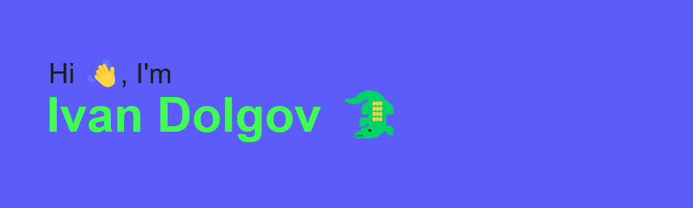

🌱 I’m currently learning: 基本情報技術者試験 (Japanese National Examination for Basic Information Technology Engineers)

📫 How to reach me: algiator5278@gmail.com

🌎 Speak next languages: Russian, English, Japanese

🗾 Currently live in Japan, Tokyo

<!--
**aligator527/aligator527** is a ✨ _special_ ✨ repository because its `README.md` (this file) appears on your GitHub profile.

Here are some ideas to get you started:

- 🔭 I’m currently working on ...
- 🌱 I’m currently learning ...
- 👯 I’m looking to collaborate on ...
- 🤔 I’m looking for help with ...
- 💬 Ask me about ...
- 📫 How to reach me: ...
- 😄 Pronouns: ...
- ⚡ Fun fact: ...
-->
